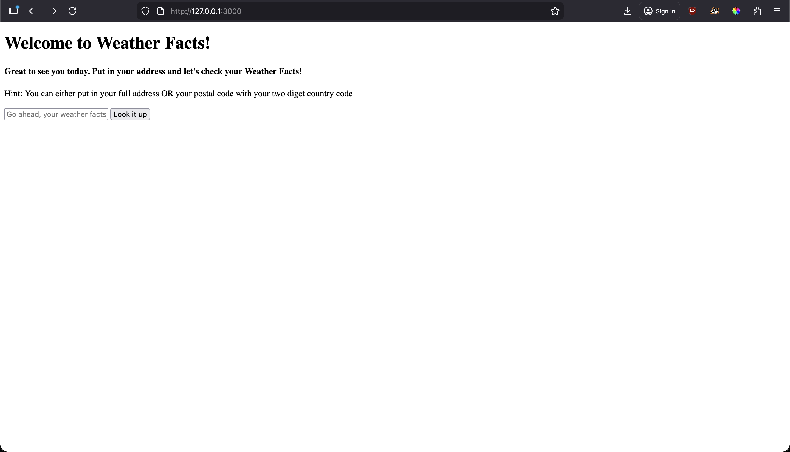
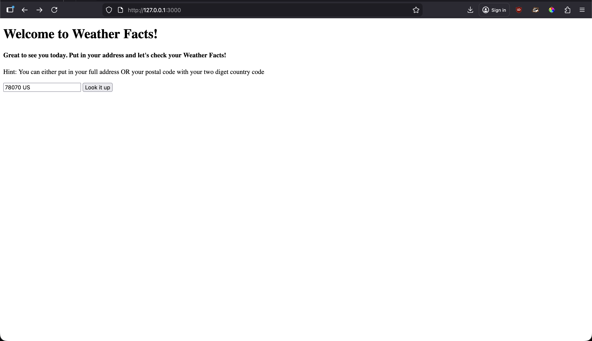
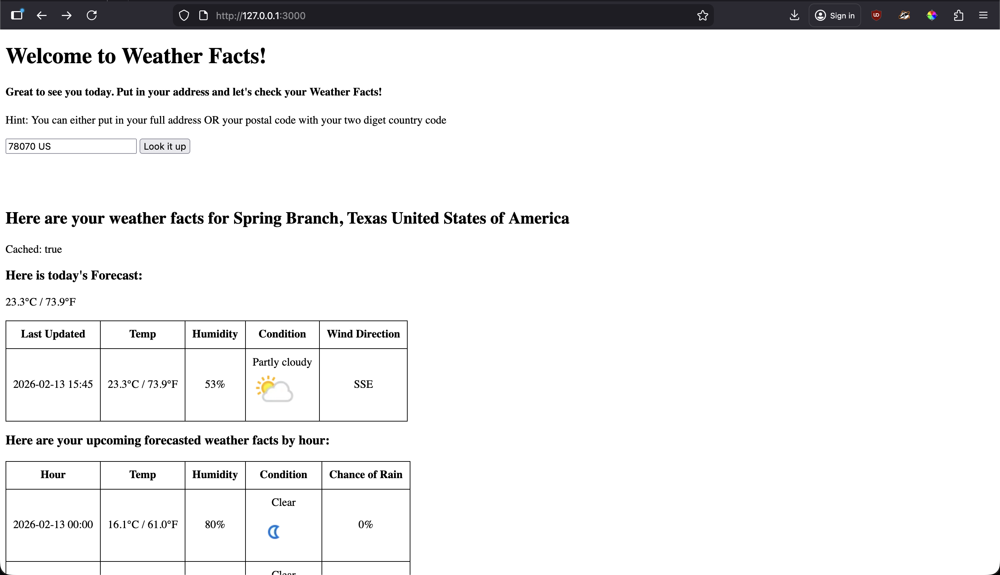
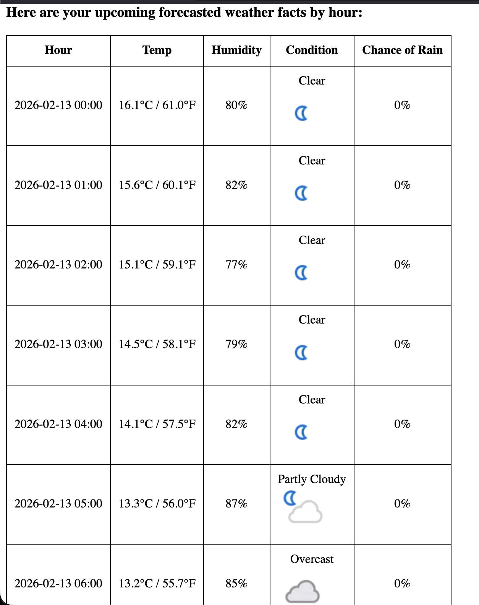
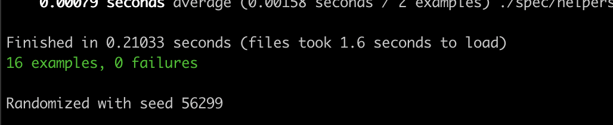

# Welcome to Weather Facts!

This is a minimalistic Ruby on Rails application built using the following stack:

- ruby 3.4.8
- Rails 8.1.2
- Rails Hotwire/Turbo
- Sqlite 3

## Before you begin:

There are a couple of steps that you will need to follow before launching this app on your local machine.

### Prerequisits
This application assumes you have installed ruby 3.4.8 locally. To find out how to do this on your machine, visit [https://www.ruby-lang.org/en/documentation/installation/](https://www.ruby-lang.org/en/documentation/installation/)

Next Steps

1. Create your own .env in the root directory
2. Create a free Geocode account and obtain an API key (see below)
3. Create a free WeatherApi account and obtain an API key (see below)
4. Install the API key in your .env
5. Run `bundle install` in the root directory to install dependencies
6. Run `rails server` to start the application

Contratulations 🎉 You are now running Weather Facts!

### Obtaining a Geocode account
1. Go to [https://geocode.maps.co/](https://geocode.maps.co/) and create a free account
2. An API key should be listed once your account is verified
3. Modify the .env and modify the env adding `GEOCODING_API_KEY=yourapikeyhere` to the file.
4. You're done!

### Obtaining a Weather API account
1. Go to [https://www.weatherapi.com/](https://www.weatherapi.com/) and create a free account
2. An API key should be listed once your account is verified
3. Modify the .env adding `WEATHER_API_COM_API_KEY=yourapikeyhere` to the file.
4. You're done!

## Examples
Here are some screenshots to demonstrate the functionality:

## Application Tested
Many of the classes and modules are tested in addition to some low level controller testing. They are all passing!

## ToDos
This is a list of enhancements I would like to build out in the future

1. Build out robust unit testing for the HomesController
2. Re-design the UI to be more engaging using Tailwind.css
3. Deploy the application to a cost effective rails server
4. Provide a way to use the application in a deployed state as a mobile native application on iPhone and Android using Hotwire Native